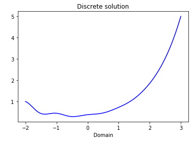

<!-- This can be hide, original code: http://zjuwhw.github.io/2017/06/04/MathJax.html --> 
<script type="text/x-mathjax-config">
MathJax.Hub.Config({
  tex2jax: {
    inlineMath: [['$','$'], ['\\(','\\)']],
    processEscapes: true
  }
});
</script>
<script src="https://cdnjs.cloudflare.com/ajax/libs/mathjax/2.7.0/MathJax.js?config=TeX-AMS-MML_HTMLorMML" type="text/javascript"></script>

# A High Order Finite Element Code for $$H^1(a,b)$$
This code was developed during UNIDEL 2017 with Francisco-Javier Sayas and Connor Swalm. 
## IPython version

This is a "simple" implementation for a high order FEM  for  $$H^1(a,b)$$. We use Lobatto functions   
<!-- Lenguages supported by Jekyll https://simpleit.rocks/ruby/jekyll/what-are-the-supported-language-highlighters-in-jekyll/-->
### Libraries
```py
import numpy as np                       # package for scientific computing
from scipy.linalg import eigh            # eigenvalues and eigenvectors for symmetric matrices
from numpy.polynomial import Legendre    # Legendre : Legendre polynomials
from scipy.sparse import csc_matrix      # csc_matrix : similar to sparse() in Matlab
from scipy.sparse.linalg import spsolve  # spsolve : solves sparse linear systems AX = B
import matplotlib.pyplot as plt          # package for plotting
import cProfile                          # provide deterministic profiling
```
### Basis in the reference element $$[-1,1]$$.
```py
def polynomial_basis(k, t):  # Lobatto functions of degree k at the points t
    # Last Modified Friday December 21 2018
    m = len(t)                                                             # length of t
    leg = np.zeros([m, k + 1])
    for kind in range(0, k+1):
        leg[:, kind] = np.sqrt((2*kind+1) / 2) * Legendre.basis(kind)(t)   # Legendre Normalized poly at t
    p = leg * np.sqrt(2.0 / (2 * np.arange(k + 1) + 1))
    psi = np.zeros([m, k+1])
    # Lobatto polynomial functions
    psi[:, 0] = 0.5 * (1 - t)
    psi[:, 1] = 0.5 * (1 + t)
    correction = np.sqrt(1 / (2 * (2 * np.arange(2, k + 1) - 1)))
    psi[:, 2:k + 1] = correction * (p[:, 2:k+1] - p[:, 0:k-1])
    # derivative Lobatto polynomial functions
    psi_p = np.zeros([m, k + 1])
    psi_p[:, 0] = -0.5
    psi_p[:, 1] = 0.5
    psi_p[:, 2:k+1] = leg[:, 1:k]
    return psi, psi_p
```
### Quadrature rule
```py
def quad_points(x, tt):  # integration pts in the physical elements; t quadrature points in (-1,1), x is the partition
    # Last Modified Wednesday December 18 2018
    n = np.size(x)
    nqd = len(tt)
    tt = tt.reshape((1, nqd))
    h = 0.5 * (x[:, 1:n]-x[:, 0:n-1])
    aa = ((np.transpose(tt)+1)*h)+x[:, 0:n-1]
    return aa
```
### "Testing": Returns a matrix with entries $$A_{ij}  \approx \int_{[x_j x_{j+1}]} f(x)P_{i-1}dx$$
```py
def testing(f, xx, k):  # returns a (k+1)x(No. of elements) matrix
    n_el = np.size(xx) - 1
    hh = 0.5 * (xx[:, 1:n_el + 1] - xx[:, 0:n_el])
    t, wts = gaussian_quad(k + 2)
    p_si, _ = polynomial_basis(k, t)
    aa = np.transpose(wts) * p_si
    aa = hh * (np.transpose(aa) @ f(quad_points(xx, t)))
    return aa
```
### Mass Matrix ( $$d\mu =\rho(x)dx$$)
```py
def mass_matrix(rho, xx, k):    # Output: A := (k+1) x (k +1) x (No. of elements) matrix (Numpy order is different)
                                # x must be an (1, n) array,
                                # rho: vectorized function, the output must have same shape than input.
                                # k: poly degree
    n_el = np.size(xx) - 1
    hh = 0.5 * (xx[:, 1:n_el+1]-xx[:, 0:n_el])
    n_qd = int(np.ceil(1.5*k+0.5))
    points, weights = gaussian_quad(n_qd)
    p_si, _ = polynomial_basis(k, points)
    rr = rho(quad_points(xx, points))
    rr = rr * hh                                    # Column-wise multiplication
    aa = np.zeros((k+1, (k+1)*n_el))
    for q in np.arange(n_qd, dtype=np.uint32):
        aa = aa + np.kron(rr[q, :], weights[:, q] * np.outer(p_si[q, :], p_si[q, :]))
    aa = np.transpose(aa)
    aa = aa.reshape(n_el, k+1, k+1, order='C')
    return aa
```
### Stiffness Matrix ( $$d\mu =c(x)dx$$)
```py
def stiffness_matrix(c, xx, k):     # Output: A := (k+1) x (k +1) x (No. of elements) matrix (Numpy order is different)
                                    # x must be an (1, n) array,
                                    # c: vectorized function, the output must have same shape than input.
                                    # k: poly degree
    n_el = np.size(xx) - 1
    hh = 0.5 * (xx[:, 1:n_el + 1] - xx[:, 0:n_el])
    n_qd = int(np.ceil(1.5 * k))                     # np.ceil returns a float64
    points, weights = gaussian_quad(n_qd)
    _, p_sip = polynomial_basis(k, points)
    cc = c(quad_points(xx, points))
    cc = cc * (1/hh)                                 # Column-wise multiplication
    aa = np.zeros((k + 1, (k + 1) * n_el))
    for q in np.arange(n_qd, dtype=np.uint32):
        aa = aa + np.kron(cc[q, :], weights[:, q] * np.outer(p_sip[q, :], p_sip[q, :]))
    aa = np.transpose(aa)
    aa = aa.reshape(n_el, k + 1, k + 1, order='C')
    return aa
```
### Degrees of freedom (table)
```py
def dof(n_elt, k):   # local-to-global operator (k+1) x Nelt matrix.
    # Last Modified Tuesday December 18 2018
    l2g = np.ones([k+1, n_elt], dtype=np.uint32)   # zero-initialization, it works until 4.294.967.294 dof
    g = np.arange(1, k + 2, dtype=np.uint32)        # g = [1 2 3 ··· k k+1]
    g = np.roll(g, 1)                               # g = [k+1 1 2 3 ··· k]
    g[0] = 1                                        # g = [1 1 2 3 ··· k]
    g[1] = k + 1                                    # g = [1 k+1 2 3 ··· k]
    g = np.reshape(g, (k+1, 1))
    col = np.arange(0, n_elt)
    l2g = ((k * l2g) * col)+g
    return l2g-1
```
### Assembly Mass Matrix or Stiffness Matrix
```py
def assemble(w):  # Assembly of W, W is (k+1) x (k+1) x Nelt (Numpy shape (Nelt,k+1,k+1))
    dim = w.shape
    n_el = dim[0]
    k = dim[1] - 1
    l2g = dof(n_el, k).flatten('F')            # l2g(:)
    l2g = np.reshape(l2g, ((k+1) * n_el, 1))   # col vector N x 1
    cols = np.tile(l2g, k+1)
    cols = np.reshape(cols, (n_el, k+1, k+1), order='C')
    cols = np.transpose(cols, (0, 1, 2))
    cols = np.moveaxis(cols, 1, 2)
    rows = np.moveaxis(cols, 1, 2)
    w = w.flatten('F')                         # w = w(:)
    cols = cols.flatten('F')
    rows = rows.flatten('F')
    ww = csc_matrix((w, (rows, cols)), shape=(n_el*k+1, n_el*k+1))
    return ww
```
### Assembly load vector
```py
def vector_assemble(w):  # Assembly of W, load vector Numpy (k+1,n_el) : similar to accumarray Matlab
    dim = w.shape
    n_el = dim[1]               # dim(end)
    k = dim[0]-1
    l2g = dof(n_el, k).flatten('F')
    w = w.flatten('F')
    ww = np.zeros((k*n_el+1, 1)).flatten('F')     # k*n_el+1 = dimension space (system size)
    np.add.at(ww, l2g, w)
    return ww
```
### Solver for $$ (cf(x)u'(x))'+\rho(x)u(x)=f(x)$$ plus boundary conditions. D: Dirichlet, N: Neumann
```py
def fem_1d(xx, k, cf, rho, bc, f, bval):
    n_el = np.size(xx) - 1
    n_dof = (n_el * k) + 1
    free = np.arange(n_dof)
    ss = assemble(stiffness_matrix(cf, xx, k) + mass_matrix(rho, xx, k))
    b = vector_assemble(testing(f, xx, k))
    if bc[0] == "N":
        b[0] = b[0] + bval[0]
    if bc[1] == "N":
        b[1] = b[1] + bval[1]
    uh = np.zeros((n_dof, 1)).flatten('F')
    dir = []
    if bc[0] == "D":
        free = free[1:n_dof]
        dir = [0]
        uh[0] = bval[0]
    if bc[1] == "D":
        free = free[0:-1]
        dir = dir+[n_dof-1]
        uh[n_dof-1] = bval[1]
    b = np.transpose(b) - (ss[:, dir] @ uh[dir]).flatten('F')
    uh[free] = spsolve(ss[free, :][:, free], b[free])
    return uh
```
### Plotting Tool
```py
def plotting_tool(x, k, fh):  # plots fh on a fine mesh  https://matplotlib.org/users/pyplot_tutorial.html
    n_elt = np.size(x)-1
    t = np.linspace(-1.0, 1.0, num=40)  # num points on each interval of the partition
    pts = quad_points(x, t)
    p_si, p_sip = polynomial_basis(k, t)
    l2g = dof(n_elt, k)
    l2g = fh[l2g]  # split by row
    l2g = np.reshape(l2g, (k+1, n_elt))
    fh = p_si @ l2g
    pts = pts.flatten('F')
    fh = fh.flatten('F')
    plt.xlabel('Domain')
    plt.ylabel(' ')
    plt.title('Discrete solution')
    plt.plot(pts, fh, '-b')  # plt.plot(t1, f(t1), 'bo', t2, f(t2), 'k')
    plt.show()
    return 0
```
### $$L^2-$$ projection with the measure $$d\mu=\rho(x)dx$$
```py
def l2_projection(xx, k, rho, f):
    rho_f = lambda x: f(x) * rho(x)
    mm = mass_matrix(rho, xx, k)
    mm = assemble(mm)
    b = testing(rho_f, xx, k)
    b = vector_assemble(b)
    fh = spsolve(mm, b)
    return fh
```
### $$L^2-$$ norm
```py
def l2_norm(xx, k, f, fh):
    n_el = np.size(xx) - 1  # len(x) = 1
    hh = 0.5 * (xx[:, 1:n_el + 1] - xx[:, 0:n_el])
    t, wts = gaussian_quad(4 * k)
    ff = f(quad_points(xx, t))
    p_si, _ = polynomial_basis(k, t)
    ffh = p_si @ fh[dof(n_el, k)]
    rr = np.absolute(ff-ffh)
    rr = np.power(rr, 2)
    error = np.sqrt(wts @ (rr @ np.transpose(hh)))
    return error
``` 
### $$H^1-$$ seminorm
```py
def h1_semi_norm(xx, k, df, fh):
    n_el = np.size(xx) - 1  # len(x) = 1
    hh = 0.5 * (xx[:, 1:n_el + 1] - xx[:, 0:n_el])
    t, wts = gaussian_quad(4 * k)
    dff = df(quad_points(xx, t))
    _, p_sip = polynomial_basis(k, t)
    ffh = p_sip @ ((1 / hh) * fh[dof(n_el, k)])
    rr = np.absolute(dff-ffh)
    rr = np.power(rr, 2)
    error = np.sqrt(wts @ (rr @ np.transpose(hh)))
    return error
```    
## Example: \begin{align} u''(t)+u(t)=e^{-t}\cos(2\pi t)\\ \u \end{\align}  $$u''(t)+u(t)=e^{-t}\cos(2\pi t)$$ with $$x\in (-2,3)$$, Dirichlet BC and using $$k=7$$. 
```py
def rho(t):   # t must be a (n, m) Numpy array
    dim = np.shape(t)
    rh = np.ones((dim[0], dim[1]))
    return rh

def cf(t):   # t must be a (n, m) Numpy array
    dim = np.shape(t)
    rh = np.ones((dim[0], dim[1]))
    return rh

def f(t):
    return np.exp(-t) * np.cos(2*np.pi*t)


def df(t):
    return -np.exp(-t) * (np.cos(2*np.pi*t) + 2*np.pi*np.sin(2*np.pi*t))
```
```py
x = np.linspace(-2.0, 3.0, num=300)
x = np.reshape(x, (1, 300))
k = 7
bc = "DD"
bval = np.array([1, 5])
```
###  Profile  
```py
%timeit  fem_1d(x, k, cf, rho, bc, f, bval)
```
Output for this example:  $$11.7ms \pm 207 \mu s$$ per loop (mean $$\pm$$ std. dev. of 7 runs, 100 loops each)
###  Discrete Solution  
```py
uh = fem_1d(x, k, cf, rho, bc, f, bval)
```
###  Plotting $$u_h(t)$$
```py
plotting_tool(x, k, uh)
```
### Output

### Checking the error
```py
np.set_printoptions(precision=8)  # determine the way floating point numbers are displayed (Numpy)
fh = l2_projection(x, k, rho, f)
error = l2_norm(x, k, f, fh)
print(error)
```
Output: 3.33565134e-14

